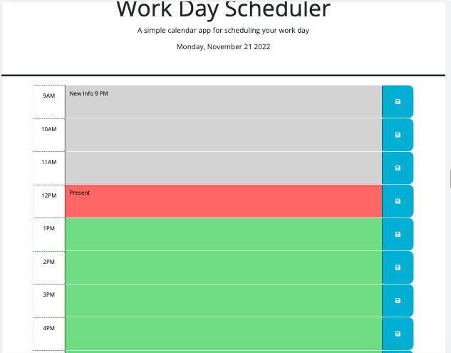

# Work-Day-Scheduler
_Branches: The **main** branch contains React code. The **gh-pages** branch contains the GitHub Pages code._

This repository contains two **branches** . The main branch contains the react code minus build and node_modules folders. The gh-pages branch was contains the HTML code for Github Pages. 

This web app is a work day scheduler. It allows you to store your task organized by hours. This is a great tool that will allow you too relieve stress and multitask.

## Table of Contents

- [Description](#description)
- [Screen Shots](#screenshots)
- [Installation](#installation)
- [React Specific Installation](#reactspecific)
- [References](#references)
- [License](#license)

## Description
This repo contains a work day scheduler web app and corresponding code.

Github Repository: [work-day-scheduler](https://github.com/rbarbosa51/work-day-scheduler/tree/main)

Github Pages: [Work Day Scheduler Page](https://rbarbosa51.github.io/work-day-scheduler/)

## Screenshots
Work Day Scheduler

## Installation

It is meant to be viewed from Github Pages.
To download the code and try it out yourself, do the following.
git clone https://github.com/rbarbosa51/work-day-scheduler.git
Go to the directory, and run npm install. 
Then npm start -> Needs to be runned on react webserver in order to work (non - production).
Alternatevely you can run: npm run build  -> This will build a production ready code.

## ReactSpecific
1) Github Create Repo   (Empty no readme. The repo needs to be empty. Otherwise it will collide with the create-react-app git config)
2) Github is going to give you a set of instructions copy them down
3) Go to the file directory where you are going to set up then run: 
npx create-react-app <project-name>
4) Change Directory to the new project. cd <project-name>. 
5) Run git status. You will notice that create-react-app (CRA) created a git initialized folder.
6) Open Visual Studio Code in the new project directory. Or use code . if configured.
7) Run npm start. It takes a second but you will be able to see the initial boilerplate react page in the browser.
8) Close the server. Then run: npm install gh-pages --save-dev. This tool is needed in order to publish to Github pages.
9) Delete the contents of the README.md file. Then write “# <project-name>”. Later, create the real readme file.
10) Edit package.json file. In the top of the file below the name and version add:
“homepage”: “https://<YourGithubUserName>.github.io/<RepoName>”. 
11) Then in the same package.json file. Under the “scripts” object write:
"predeploy": "npm run build",
"deploy": "gh-pages -d build",
11) In the command line write: 
git branch -M main	This will rename the master branch (default) to main (Github standard)
12) Then write:
git remote add origin https://github.com/<YourGithubUserName>/<RepoName>.git
13) Write:
git add .
git commit -m “Some commit text”
git push -u origin main
This stages, commits and the pushes the react portion of your code to your GitHub repo. Go to Github and ensure that your code pushed correctly.
14) Now, to deploy to Github Pages:
npm run deploy
Give it a couple of minutes and you should see that you now have published GitHub pages with the React Boilerplate 
15) npm install bootstrap
16) npm install @fortawesome/react-fontawesome
17) npm install @fortawesome/free-solid-svg-icons
18) npm install days

## References

Rafael Barbosa

Bootstrap React:	 https://blog.logrocket.com/using-bootstrap-with-react-tutorial-with-examples/

Bootstrap5 W3Schools	https://www.w3schools.com/bootstrap5/index.php

React W3Schools		https://www.w3schools.com/REACT/default.asp

react-gh-pages 		https://github.com/gitname/react-gh-pages

Bootstrap with React: 	https://www.geeksforgeeks.org/how-to-use-bootstrap-with-react/

Font Awesome	https://fontawesome.com/docs/web/use-with/react/

React-FontAwesome	https://www.digitalocean.com/community/tutorials/how-to-use-font-awesome-5-with-react

LocalStorage / React Hooks	https://blog.logrocket.com/using-localstorage-react-hooks/

useEffect Hook		https://www.w3schools.com/react/react_useeffect.asp

Day.js npm 			https://day.js.org/docs/en/installation/node-js

## License

MIT License

---- 

